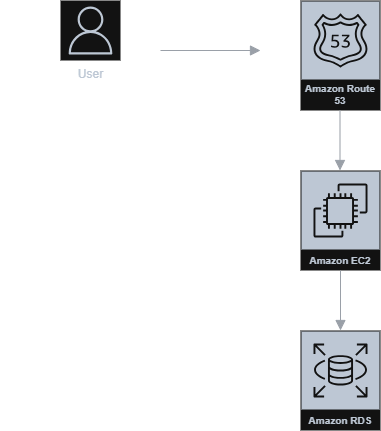

# E-Learning System – Data & Cloud Project

## Project Overview
This project is an academic E-Learning system designed to support online learning with multiple user roles including learners, instructors, and employees.

## My Responsibilities
- Analyzed user requirements and structured relational databases
- Deployed data storage on AWS RDS (Aurora)
- Implemented business functionalities for learners, instructors, and employees
- Deployed the system on AWS EC2 with RDS and Route 53

## Technologies Used
- Database: SQL Server, AWS RDS (Aurora)
- Cloud Platform: AWS EC2, Route 53
- Tools: SQL, Git, GitHub

## System Architecture

## Database Design

## Notes
This repository focuses on system design, database structure, and cloud deployment for learning and demonstration purposes.
