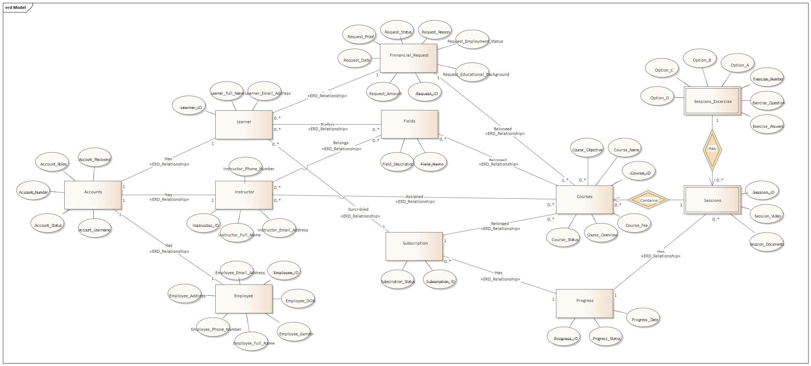

# E-Learning System – Data & Cloud Project

## Project Overview
Academic project focused on designing, deploying, and managing an E-Learning system with multiple user roles.

## My Responsibilities
- Analyzed user requirements and designed relational database structures
- Deployed and managed data storage using AWS RDS (Aurora)
- Implemented core business functionalities for learners, instructors, and employees
- Deployed the system on AWS EC2 integrated with RDS and Route 53

## Technologies Used
- Database: SQL Server, AWS RDS (Aurora)
- Cloud Services: AWS EC2, Route 53
- Tools: SQL, Git, GitHub

## Database Design

## Cloud Architecture

## Notes
This repository highlights my experience in data modeling, system design, and cloud-based deployment for academic projects.
